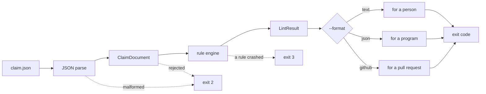
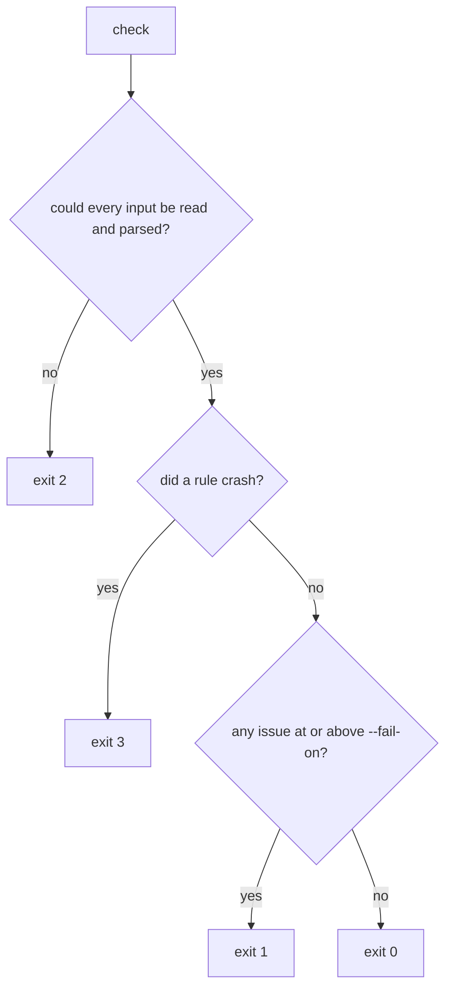
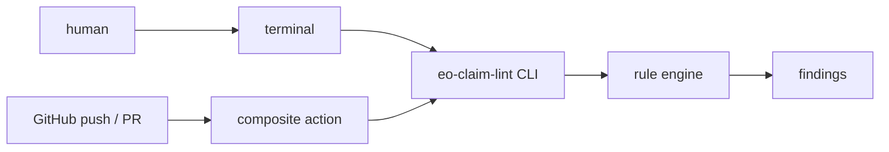

# eo-claim-lint

A linter for checking whether Earth observation claims distinguish measurements,
estimates, uncertainty, and supporting evidence.

## Project status

**Early development.**

- The API is **not yet stable**. Anything may change without notice while the
  version is `0.x`.
- **Implemented so far:** the claim document data model, the report data model,
  three JSON Schemas, a deterministic rule engine with ten rules, a
  command-line interface, and a composite GitHub Action.
- **Not implemented:** reading configuration from a file.
- Not published to PyPI, and this repository has no public remote yet. The
  GitHub Action is written and tested locally but **has never run on a
  GitHub-hosted runner**.

## Quick start

```bash
python -m venv .venv
source .venv/bin/activate          # Windows: .venv\Scripts\activate
python -m pip install -e ".[dev]"

eo-claim-lint init                 # write an example document
eo-claim-lint check claim-document.json
eo-claim-lint rules                # what gets checked
eo-claim-lint schema claim         # the input schema
```

The example that `init` writes passes every rule, so the first `check` you run
succeeds. Break something in it — delete the `evidence` array — and run `check`
again to see what a finding looks like.

### From input to exit code



## Commands

| Command | What it does |
|---|---|
| `check [FILE...]` | Check documents. `-` reads one from stdin. |
| `rules [--rule ID]` | List the rules, or describe one. |
| `schema NAME` | Print a bundled schema: `claim`, `lint-output`, `cli-output`. |
| `init [PATH]` | Write a synthetic example document. |

### `check` options

| Option | Default | Meaning |
|---|---|---|
| `--format {text,json,github}` | `text` | Output format. |
| `--output PATH` | stdout | Write the report to a file. |
| `--force` | off | Allow `--output` to overwrite. |
| `--quiet` | off | Drop the summary line; print nothing when clean. |
| `--fail-on {error,warning,info}` | `error` | Lowest severity that exits 1. |
| `--enable RULE_ID` | — | Run only these rules. Repeatable. |
| `--disable RULE_ID` | — | Skip these rules. Repeatable. |
| `--severity RULE_ID=SEVERITY` | — | Report a rule at another severity. Repeatable. |
| `--stdin-name NAME` | `<stdin>` | Label to report stdin under. |
| `--no-color` | off | Accepted for compatibility; output is never coloured. |

## Exit codes

| Code | Meaning |
|---|---|
| `0` | Nothing at or above the `--fail-on` threshold. |
| `1` | The threshold was reached. |
| `2` | The invocation or the input was wrong: missing file, malformed JSON, unknown rule, contradictory options. |
| `3` | **The linter itself failed.** Not a statement about your document. |

Code `3` exists so that a bug in this package cannot masquerade as a finding
about your data. If you see it, it is our fault, not the document's.



### `--fail-on` is not the same as `valid`

`valid` in the JSON report answers *does this document carry an error?*
The exit code answers *should this build stop?* They can disagree, and both
answers are correct:

```console
$ eo-claim-lint check --format json --fail-on warning estimate.json
{ ... "valid": true, "summary": {"errors": 0, "warnings": 1, "info": 0} }
$ echo $?
1
```

The document carries no error, so the report is valid. You asked to stop on
warnings, so the process failed. Choose `--fail-on` to express your policy;
read `valid` to learn what was found.

## Output examples

**text** — one line per finding, then a summary:

```console
$ eo-claim-lint check bad.json
bad.json: EOC301 error $.evidence This claim references no evidence. Add at least one reference so that a reader can trace where the value came from.
1 file checked: 1 error, 0 warnings, 0 info
```

**json** — nothing but JSON on stdout, matching `cli-output-0.1`:

```json
{
  "schema_version": "0.1",
  "tool": { "name": "eo-claim-lint", "version": "0.1.0" },
  "valid": false,
  "files": [
    {
      "source": "bad.json",
      "valid": false,
      "issues": [
        {
          "rule_id": "EOC301",
          "severity": "error",
          "message": "This claim references no evidence. …",
          "path": "$",
          "field": "evidence",
          "doc_url": null,
          "context": { "claim_type": "interpretation" }
        }
      ]
    }
  ],
  "summary": { "files": 1, "errors": 1, "warnings": 0, "info": 0 }
}
```

**github** — workflow commands that GitHub turns into annotations:

```console
$ eo-claim-lint check --format github bad.json
::error file=bad.json,title=EOC301::$.evidence: This claim references no evidence. …
```

Severities map to `error`, `warning`, and `notice`, because GitHub has no
"info" annotation. Messages and property values are escaped, so a finding can
never inject a workflow command of its own.

## Multiple files, and stdin

`check` accepts several paths and reports them in the order given. `-` reads a
single document from stdin and cannot be combined with file arguments.

**If any input cannot be read, the whole run fails with code 2 and prints no
report.** A partial report would look exactly like a complete one to whatever
consumes it, and an unchecked file would quietly pass as checked.

## GitHub Action

**Status: implemented locally, not published.** The repository has no public
remote, so there is nothing to reference with `uses:` yet, and the action has
never executed on a GitHub-hosted runner. The examples below are the intended
usage after publication.

The action does no checking of its own. It sets up Python, installs this
package from its own checkout, and runs `eo-claim-lint check --format github`.
The annotations you see on a pull request are produced by the same code you get
in a terminal.



### Minimal workflow

```yaml
name: Claim documents

on: pull_request

permissions:
  contents: read # nothing else is needed

jobs:
  lint:
    runs-on: ubuntu-latest
    steps:
      - uses: actions/checkout@v4
      - uses: OWNER/eo-claim-lint@v0 # placeholder: not published yet
        with:
          files: claims/*.json
```

More examples — failing on warnings, disabling a rule, overriding a severity —
are in [`examples/github-action.yml`](examples/github-action.yml).

### Inputs

| Input | Required | Default | Meaning | CLI mapping |
|---|---|---|---|---|
| `files` | Yes | — | Documents to check. One path or glob per line. | positional arguments |
| `fail-on` | No | `error` | Lowest severity that fails the step. | `--fail-on` |
| `enable` | No | empty | Run only these rules. One id per line. | `--enable` (repeated) |
| `disable` | No | empty | Skip these rules. One id per line. | `--disable` (repeated) |
| `severity` | No | empty | Overrides, one `RULE_ID=SEVERITY` per line. | `--severity` (repeated) |
| `python-version` | No | `3.11` | Python used to run the linter. | `actions/setup-python` |
| `working-directory` | No | `.` | Base for the file patterns. | wrapper |

**Newlines are the only separator.** Splitting on spaces as well would make a
path containing a space impossible to express, so `my claims/a.json` on its own
line is one path, not two.

### Outputs

| Output | Meaning | Values |
|---|---|---|
| `exit-code` | The linter's own exit status. | `0` / `1` / `2` / `3` |
| `outcome` | The same, named. | `passed` / `lint-failed` / `usage-error` / `internal-error` |

There is deliberately no `valid` output. Producing one would mean running the
linter a second time in JSON format, and a report that can disagree with the
annotations beside it is worse than no report.

### Permissions and secrets

`contents: read`, and nothing else. Annotations travel as workflow commands
printed to stdout, so no write permission is involved. **The action needs no
secrets, no `GITHUB_TOKEN`, and no network access beyond `pip` and
`setup-python`.** It never contacts a schema URL or an Earth observation
service.

### Exit behaviour

The action passes the linter's exit code through unchanged, and never collapses
one code into another. In particular `2` (your invocation was wrong) and `3`
(our linter broke) stay distinguishable in `steps.<id>.outputs.exit-code`, even
though GitHub reports all three non-zero codes as a failed step.

### Annotation example

```
::error file=claims/bad.json,title=EOC301::$.evidence: This claim references no evidence. …
```

### Limitations

- **`files` does not recurse.** The CLI has no recursive mode, and an action
  that quietly checked more than the CLI would make the two disagree.
- **A pattern matching nothing is an error**, not an empty pass. Reporting
  success for a repository nobody looked at is the failure this tool exists to
  prevent.
- **Everything must stay inside the workspace.** `working-directory` and every
  matched file are resolved and checked for containment, so `../..` and a
  symlink leading out of the checkout are both refused. Symlinks *within* the
  workspace are followed normally.
- **No file size limit.** Documents are read whole. This matches the CLI; an
  action-only cap would make the two disagree about the same file.
- **Configuration files are not supported.** Rules are selected through the
  `enable`, `disable`, and `severity` inputs.
- **Never validated on a GitHub-hosted runner.** Everything above is verified
  by local tests over the action metadata and the wrapper.

## Schema validation at runtime

`check` does not validate against the JSON Schema. Validation needs a schema
library, and this package has no runtime dependencies. What it does instead is
build a `ClaimDocument`, which rejects missing required fields, unknown
enumerated values, wrong types, and self-inconsistent values such as an
interval whose lower bound exceeds its upper bound.

The schemas are still shipped, and `eo-claim-lint schema` prints them, so you
can validate in your own pipeline with the tool of your choice.

## Purpose

When a result derived from satellite or weather data is published to a general
audience, two very different things end up on the same page: what an instrument
actually recorded, and what a model concluded from it. Once they are rendered
with the same styling, a reader cannot tell them apart — and neither can a
reviewer, six months later, reading the artifact instead of the code.

`eo-claim-lint` checks the artifact.

- **Structural integrity of a claim document** — the declared layers exist, the
  manifest and the items agree, nothing is declared that is not there.
- **Measured observations are distinguishable from estimates** — an estimate
  carries the method and confidence that make it recognisable as an estimate,
  and a measured artifact does not quietly reference an estimated value.
- **Uncertainty and evidence are not missing** — an estimate that asserts a
  class or category has to say where its thresholds came from. If the
  provenance of a threshold cannot be disclosed, the class should not be
  asserted.

The tool works on structured data and the labels rendered from it. It reads
what a document claims about itself.

## Non-goals

`eo-claim-lint` does **not** do any of the following, and is not intended to
grow into them:

- satellite image processing
- scientific validation of numeric values (it never recomputes a number)
- legal evidence certification
- notarization
- agricultural risk prediction
- yield prediction
- general prose linting (use [Vale](https://vale.sh/) or
  [textlint](https://textlint.github.io/) for that)
- GIS processing
- an MCP server
- automatic fixing of anything it reports

Passing this linter means a document is internally consistent about what it
claims. **It does not mean the underlying data is correct, and it does not make
any statement legally valid.**

## The claim document

A **claim document** is one claim, expressed as a single JSON object, with
enough context to tell what kind of claim it is. It is the unit this linter
reads.

```json
{
  "schema_version": "0.1",
  "claim_id": "claim-001",
  "claim": {
    "type": "observation",
    "statement": "A vegetation index was computed for the specified area.",
    "value": 0.42,
    "unit": "1"
  },
  "data_origin": "measured",
  "data_processing": "derived",
  "spatial_scope": { "type": "named_area", "name": "Example Area" },
  "temporal_scope": { "observed_at": "2026-01-15T01:30:00Z" },
  "evidence": [
    {
      "id": "evidence-001",
      "type": "dataset",
      "title": "Example synthetic source record",
      "uri": "urn:example:evidence:001"
    }
  ],
  "display": { "label": "Measured vegetation index" },
  "processing": { "method": "Example index calculation" }
}
```

All ten top-level fields are required. `evidence` may be an empty array:
whether a particular kind of claim needs evidence is a policy question, and
policy belongs in a configurable rule rather than in the definition of what a
document *is*.

### Claim types

| Value | Meaning |
|---|---|
| `observation` | Recorded by an instrument or supplied by a data source. |
| `estimate` | Produced by a model, an interpolation, or a statistical procedure. |
| `interpretation` | A meaning assigned to an observation or an estimate. |

`prediction` is deliberately absent. A statement about the future raises
questions this version does not attempt to answer — how the forecast horizon is
declared, and how a claim is reconciled against what later happened.

### Data semantics

A claim document describes its data along **two independent axes**. A single
`real` / `mock` flag conflates them and is not used.

#### `data_origin` — where the data came from

| Value | Meaning |
|---|---|
| `measured` | Recorded by an instrument or sensor. |
| `synthetic` | Generated, for example for a demo, a test fixture, or a placeholder. |
| `unknown` | Not established. |

#### `data_processing` — how far it has been transformed

| Value | Meaning |
|---|---|
| `raw` | As delivered by the source, without derivation. |
| `derived` | Computed from measurements by a defined, deterministic procedure. |
| `modeled` | Produced by a model that adds assumptions beyond the input data. |
| `unknown` | Not established. |

Notes on reading these values:

- **`synthetic` does not mean false.** Synthetic data is legitimate and useful;
  it means the values were not recorded by an instrument. The point of labelling
  it is that a reader should never have to guess.
- **`modeled` does not imply `synthetic`.** A model can be driven entirely by
  measured inputs. Origin and processing are orthogonal, which is exactly why
  they are separate fields.
- A measured, derived value (for example a spectral index computed from measured
  bands) is `data_origin: measured`, `data_processing: derived`.

### Uncertainty

Uncertainty is optional and attaches to the claim. Four kinds are recognised:

| `kind` | Requires | Optional |
|---|---|---|
| `interval` | `lower`, `upper` | `unit`, `confidence`, `description` |
| `standard_deviation` | `value` (non-negative) | `unit`, `confidence`, `description` |
| `qualitative` | `description` | `confidence` |
| `unknown` | — | `description` |

`confidence` is a fraction between 0 and 1, not a percentage.

An estimate that declares no uncertainty is still a **valid document**. Whether
it should be allowed is a rule, and rules are configurable; the schema stays out
of that argument.

### Scope

`spatial_scope` is either a `named_area` or a `bbox`; nothing more expressive is
supported, and no GIS or coordinate transformation is performed.
`temporal_scope` is either a single `observed_at` instant or a `start`/`end`
period — never both. All timestamps are RFC 3339 and must carry a timezone
offset.

## Schemas

Three JSON Schemas ([Draft 2020-12](https://json-schema.org/draft/2020-12/schema))
ship inside the package:

| Schema | `$id` |
|---|---|
| Claim document | `https://schemas.orbseekr.jp/eo-claim-lint/claim-document-0.1.schema.json` |
| Linter report (one document) | `https://schemas.orbseekr.jp/eo-claim-lint/lint-output-1.0.schema.json` |
| Command-line report (one run) | `https://schemas.orbseekr.jp/eo-claim-lint/cli-output-0.1.schema.json` |

**Those `$id` values are canonical identifiers, not download locations.** They
name the schemas so that two documents can agree on which version they mean.
Retrieval from those URLs is **not guaranteed**, and nothing in this package
ever fetches them. The schema files are bundled in the wheel and read through
`importlib.resources`, so **no network access is required at any point** and
neither schema contains an external `$ref`.

Load them from Python:

```python
from eo_claim_lint import load_claim_document_schema, load_lint_output_schema

schema = load_claim_document_schema()
```

Each call returns a fresh object, so a caller that modifies a schema before
handing it to a validator cannot affect the next caller.

## Report format

A report records what a run found. `valid` is **derived from the issues, never
supplied**: it is false when any issue has `error` severity, and warnings or
info alone leave a report valid. There is no way to express a report that
claims to be valid while carrying an error.

Rule identifiers match `^EOC[0-9]{3}$` and are grouped by concern: `EOC0xx`
document contract, `EOC1xx` observation and estimate separation, `EOC2xx` claim
safety, `EOC3xx` provenance and evidence, `EOC4xx` data origin and processing.
Identifiers are never reused, including after a rule is withdrawn.

`doc_url` is nullable and is currently always null: the rule documentation pages
do not exist yet, and a URL that resolves to nothing is worse than none.

## Linting

### What the rules add that the schema does not

The schema answers *is this a document?* — required fields, types, enumerated
values, basic formats. It is a structural question with a structural answer.

The rules answer *does this document contradict itself?* That question is not
structural, and it has no single right answer: whether an estimate must declare
uncertainty depends on the project. So the schema stays permissive and the
rules carry the judgement, which is why they can be switched off individually
while the schema cannot.

None of it inspects the numbers. A claim of 0.42 that should have been 4.2 will
pass every rule here.

### The rules

| ID | Default | What it looks for |
|---|---|---|
| `EOC101` | warning | An estimate that declares no uncertainty. |
| `EOC102` | warning | An observation whose data is marked as `modeled`. |
| `EOC103` | warning | An interpretation with neither uncertainty nor disclaimer. |
| `EOC201` | warning | A display label that contradicts the claim type. |
| `EOC202` | warning | A displayed unit that differs from the recorded unit. |
| `EOC203` | warning | Definitive wording while the uncertainty is `unknown`. |
| `EOC301` | **error** | A claim that references no evidence at all. |
| `EOC302` | warning | Modeled data that names no software or version. |
| `EOC401` | warning | Synthetic origin the display does not disclose. |
| `EOC402` | warning | Unknown origin the display does not disclose. |

`EOC301` is the only error by default. A claim published with nothing behind it
cannot be checked by anyone, which is the failure this tool exists to prevent.
Everything else asks for a second look rather than asserting a defect.

Each rule documents its own false-positive conditions in its docstring. Two are
worth knowing before you start:

- **`EOC202` compares units as plain strings.** A dimensionless value recorded
  as `"1"` and displayed as `"index"` is correct in both places and will still
  be reported. Lower its severity if you render units for humans.
- **`EOC201` recognises a handful of English words only.** A label that
  overstates without using one of them is not caught, and a label in another
  language is not examined at all.

### Running the rules from Python

```python
from eo_claim_lint import ClaimDocument, lint_document

document = ClaimDocument.from_dict(payload)
result = lint_document(document)

print(result.valid)
for issue in result.issues:
    print(issue.rule_id, issue.severity, issue.path, issue.message)
```

Issues come back sorted by rule id, then path, then field, then message, so two
runs over the same document produce identical output.

### Selecting and adjusting rules

```python
from eo_claim_lint import RuleConfig, Severity, lint_document

config = RuleConfig(
    disabled=frozenset({"EOC202"}),
    severity_overrides={"EOC301": Severity.WARNING},
)
result = lint_document(document, config=config)
```

Configuration selects rules and adjusts severities. It never changes *what* a
rule considers wrong — a rule whose meaning varies with configuration produces
findings that cannot be compared between projects. Naming a rule that does not
exist is an error rather than a silent no-op.

Reading configuration from a file is not implemented yet; `RuleConfig` is
constructed in Python.

### When a rule itself fails

A rule that raises produces a `RuleExecutionError`, not an issue. A broken rule
is a defect in this package, not a finding about your document, and reporting
one as the other would hide the difference. A future CLI will map it to its own
exit status.

### What linting does not do

- It does not recompute or verify any number.
- It does not establish that a claim is legally valid or admissible.
- It does not access the network, read files, or consult the environment. Rules
  see the document they were handed and nothing else.

## Public API

Everything below is importable from `eo_claim_lint` directly:

- **Linting** — `lint_document`, `RuleConfig`, `Rule`, `RuleExecutionError`,
  `get_default_rules`, `get_rule`
- **Document model** — `ClaimDocument`, `ClaimValue`, `Uncertainty`,
  `NamedAreaScope`, `BoundingBoxScope`, `SpatialScope`, `TemporalScope`,
  `EvidenceReference`, `Checksum`, `DisplayInfo`, `ProcessingInfo`
- **Report model** — `LintResult`, `LintIssue`, `Severity`
- **Enumerations** — `ClaimType`, `DataOrigin`, `DataProcessing`,
  `EvidenceType`, `UncertaintyKind`
- **Schemas** — `load_claim_document_schema`, `load_lint_output_schema`,
  `load_cli_output_schema`, `CLAIM_DOCUMENT_SCHEMA_ID`, `LINT_OUTPUT_SCHEMA_ID`,
  `CLI_OUTPUT_SCHEMA_ID`
- **Errors** — `EoClaimLintError`

Concrete rule classes live in `eo_claim_lint.rules.*` and are reached through
`get_rule`; they are not exported at the top level.

## Installation

Not on PyPI yet. From a checkout:

```bash
python -m venv .venv
source .venv/bin/activate
python -m pip install -e ".[dev]"
```

On Windows, activate with `.venv\Scripts\activate` instead.

The package has **no runtime dependencies**. `jsonschema` is a development
dependency only — it is used to test the bundled schemas, never to validate
anything at runtime.

## Building documents in Python

Documents can be constructed and serialised directly:

```python
from datetime import UTC, datetime

from eo_claim_lint import (
    ClaimDocument,
    ClaimType,
    ClaimValue,
    DataOrigin,
    DataProcessing,
    DisplayInfo,
    NamedAreaScope,
    ProcessingInfo,
    TemporalScope,
)

document = ClaimDocument(
    claim_id="claim-001",
    claim=ClaimValue(
        type=ClaimType.OBSERVATION,
        statement="A vegetation index was computed for the specified area.",
        value=0.42,
        unit="1",
    ),
    data_origin=DataOrigin.MEASURED,
    data_processing=DataProcessing.DERIVED,
    spatial_scope=NamedAreaScope(name="Example Area"),
    temporal_scope=TemporalScope(observed_at=datetime(2026, 1, 15, 1, 30, tzinfo=UTC)),
    display=DisplayInfo(label="Measured vegetation index"),
    processing=ProcessingInfo(method="Example index calculation"),
)

print(document.to_dict())
```

## Test fixtures

Every fixture under `tests/fixtures/` is **entirely fictional** — invented place
names, synthetic coordinates, `urn:example:` URIs, and placeholder checksums
that digest nothing. A fixture declaring `"data_origin": "measured"` is a
synthetic example of a document that *claims* measured origin; it is not
measured data. See [`tests/fixtures/README.md`](tests/fixtures/README.md).

## Roadmap

In order:

1. ~~**Schema** — a JSON Schema for the claim document, and one for the
   linter's own output.~~ Done.
2. ~~**Models** — the result and issue types the rules produce.~~ Done.
3. ~~**Rule engine** — the rules themselves, with stable rule IDs.~~ Done.
4. ~~**CLI** — `check`, `rules`, `schema`, `init`, with documented exit codes.~~ Done.
5. ~~**GitHub Action** — a composite action that needs no secrets.~~ Done, but never
   run on a GitHub-hosted runner.
6. **Configuration files** — reading `RuleConfig` from TOML.

## Contributing

See [CONTRIBUTING.md](CONTRIBUTING.md). Two rules matter more than the rest:
never add real-world locations or personal data to this repository, and every
new rule needs an ID, a test, and documentation.

## License

Apache License 2.0. See [LICENSE](LICENSE).
